# Project 5 Report

## Part 1: Iris

### Preprocessing
The only preprocessing I did for Iris was normalizing by z-score in order to apply principal component analysis.

### K-means
The following figures were made using the k-means clusters algorithm and telling it to find 3 clusters which is the actual number of classes from the dataset. Some of the figures also had PCA applied to the data before clustering as labeled. We can learn from these figures that k-means works decently with the Iris dataset even though it has some overlapping clusters. 

Iris kmeans raw:\
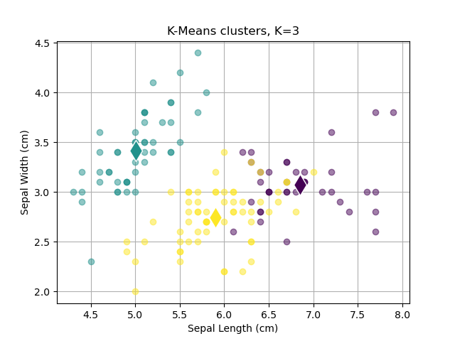

Iris kmeans pca:\
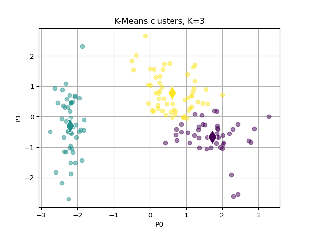

Iris actual raw:\
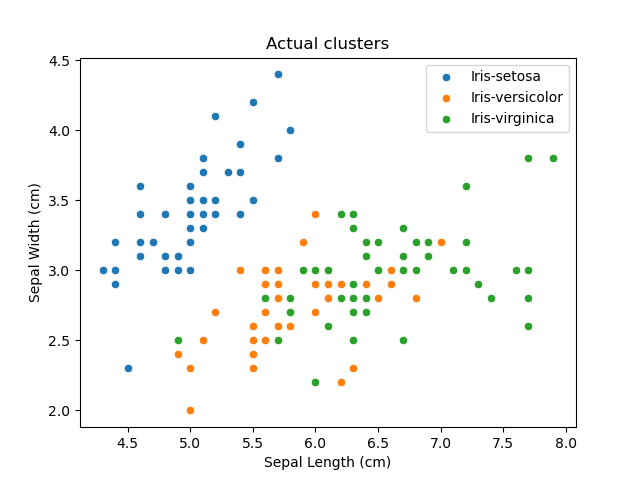

Iris actual pca:\
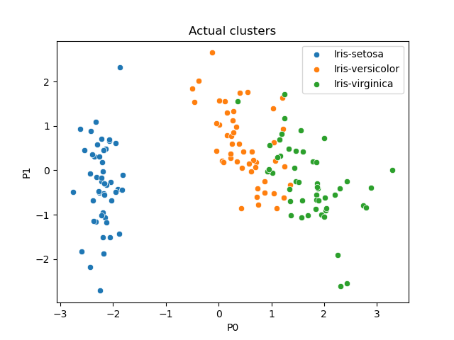

K-means reveals a pattern of types of Iris. Although k-means doesn't know which is which, it clusters them relatively accurately. This is confirmed by the actual clusters graphic. This particular dataset is hindering the performance of the k-means algorithm because it has some overlapping data. 

In order to improve the performance of k-means I performed pca on the dataset to reduce dimensions. This actually helped separate some of the overlapping data from the raw dataset. Separating the overlapping data from the raw dataset allowed k-means to better visually show the clusters from the data.

I think that the EM algorithm would be more appropriate for this dataset. This is because it would be able to describe the overlapping data better with probabilities rather than difinitively assigning a datapoint to a cluster. 

#### K=2
The following figures were made using the k-means clusters algorithm and telling it to find 2 clusters. From these figures you can learn that k-means can be justafiable if a cluster number is picked reasonably from looking at unlabeled visuals of the data.

Iris kmeans raw:\
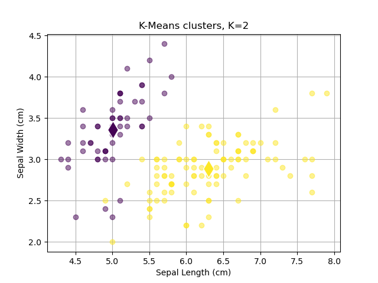

Iris kmeans pca:\
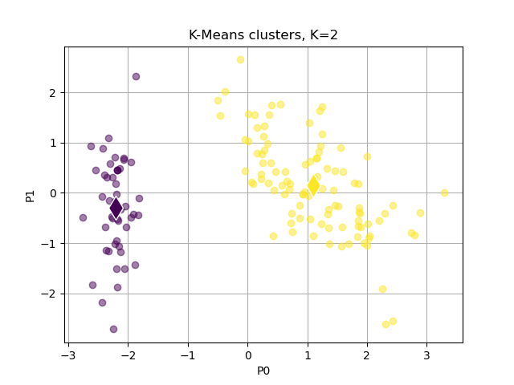

Lowering the kmeans clusters produces results that could be believable if the actual number of clusters wasn't known. This is visually the case because two of the actual clusters overlap a bit. 

### K=5
The following figures were made using the k-means clusters algorithm and telling it to find 5 clusters. From these figures you can learn that k-means just makes up clusters once you increase it beyond a reasonable number.

Iris kmeans raw:\
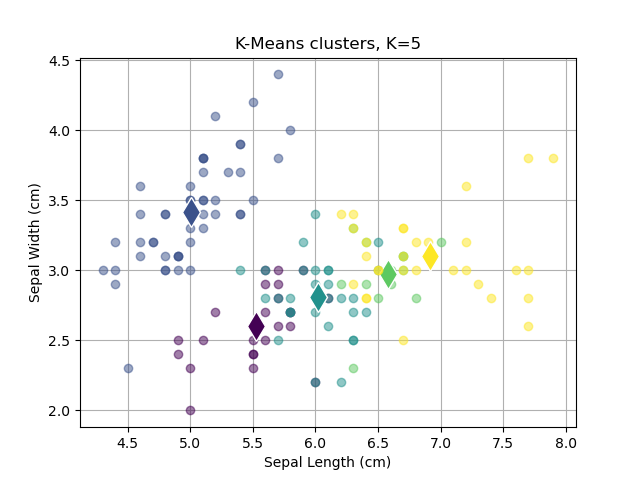

Iris kmeans pca:\
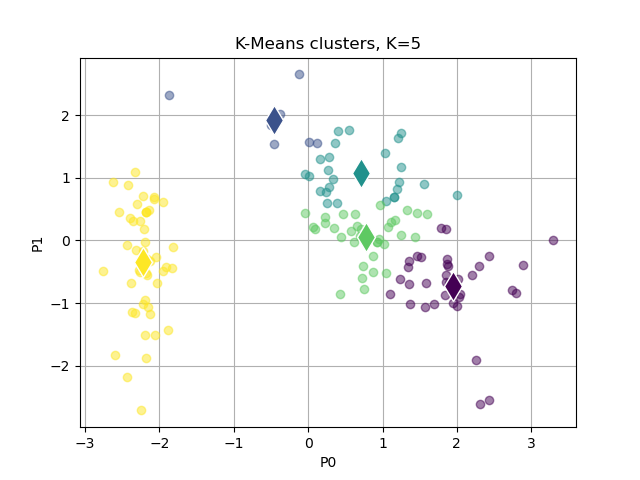

Increasing the kmeans clusters causes it to completely break down. It just breaks large clusters up into smaller ones which doesn't make sense visually because the max clusters appear to be 2 or 3 from looking at the data with no coloring. 

## Part 2: Optdigits

### Preprocessing
The preprocessing that I applied to this dataset was centering the data on the mean and sampling a few classes of numbers for clustering. 

### K-means
The following figures were made using the k-means clusters algorithm and telling it to find 5 clusters which is the actual number of classes from the dataset that I sampled. One of the figures also had PCA applied to the data before clustering as labeled. We can learn from this figure that k-means actually worked pretty well on optdigits even though the data had a lot of overlap. Although the exact points clustered may not be perfectly accurate, k-means was able to grasp the locations of the clusters almost perfectly.

Optdigits actual pca:\
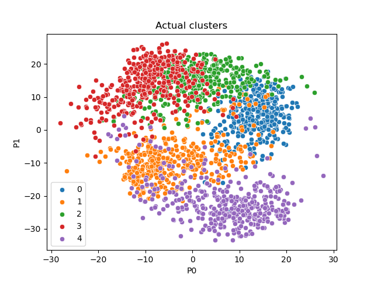

Optdigits k-means pca:\
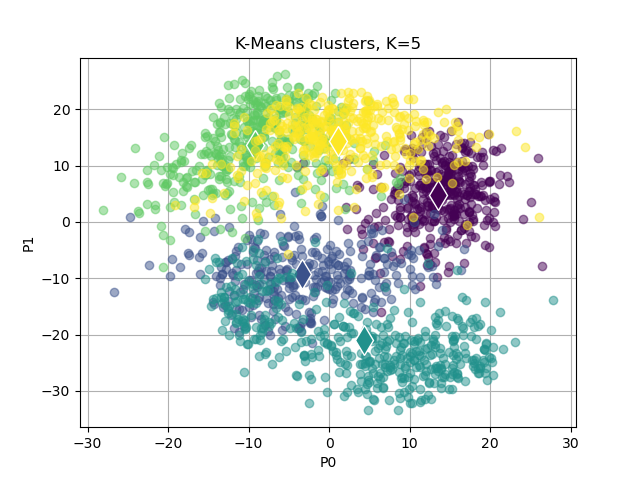

K-means revealed the clusters that can be described by the classes in the original dataset. K-means doesn't know specifically what the clusters are classified as but it grasped the locations of the clusters very well.

Applying PCA to the dataset will improve performance by reducing the dimensionality of the data and by allowing the data to actually be visualized by point. None of the features of optdigits on their own provides a useful visual of the data. This is the reason for me not having applied the k-means algorithm to the raw data, because I don't know how to meaningfully visualize that data.

Like I said with the Iris dataset, EM would be more appropriate for this dataset because it is able to more accurately describe the overlapping data with probabilities rather than sticking them into a group.

#### K=2
The following figures were made using the k-means clusters algorithm and telling it to find 2 clusters. From these figures you can learn that k-means can be justafiable if a cluster number is picked reasonably from looking at unlabeled visuals of the data. Unlabeled it could be argued that there are between 2 and 4 clusters.

Optdigits kmeans pca:\
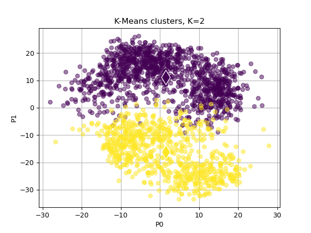

There should be 5 clusters because that is the number of classes that I sampled from the raw dataset for clustering. I would argue visually that it would be reasonable to say there are 4 clusters. With 2 clusters it still could be reasonable to assign them in the way that K-means did. 

### K=10
The following figures were made using the k-means clusters algorithm and telling it to find 10 clusters. From these figures you can learn that k-means just makes up clusters once you increase it beyond a reasonable number.

Optdigits kmeans pca:\
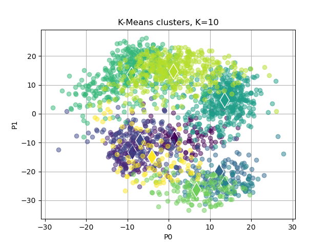

Like with k=2 there should be 5 clusters and visually without labeling 2-4 clusters could be argued. With k=10 it goes overboard and splits the roughly 4 visible clusters into multiple clusters to satisfy the requirement of 10 clusters. 