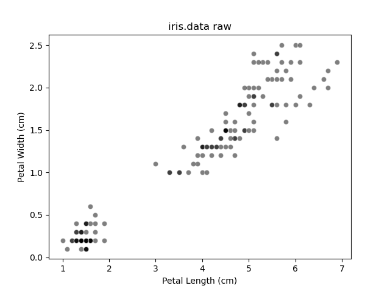
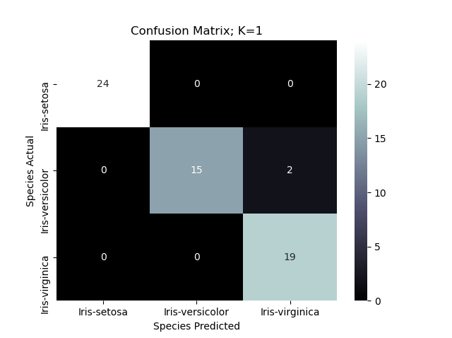
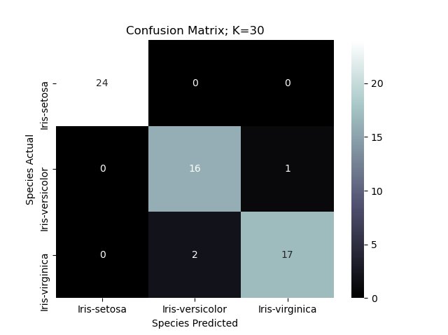
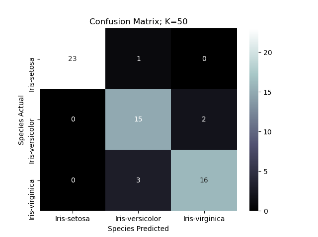

# Project 6 Report

## Part 1: Iris
Raw Data:\


I believe that KNN will perform better on this data. I think this because KNN can be fine tuned while Naive Bayes cannot. KNN may run into a little trouble where versicolors and verginicas overlap but that trouble can be mitigated with a bit of fine tuning. 

The best number of neighbors, K, for iris is 15. Below we have the different confusion matrices and rates for each K. I think 15 is best for iris because anything below has no change in precision but increasing causes precision to decrease. 

I learned from this dataset that Setosas can be identified very accurately since they are in their own cluster far from the other two types. As you increase K, KNN begins to confuse versicolor and verginica iris.

For each K the confusion matrix and performance were created and calculated the same. The confusion matrix was made by taking the predicted classes and actual classes and counting the compared classes as a matrix. The True Positive Rate, False Positive Rate, and Precision Rate were all calculated by counting the number of true positives, false positives, true negatives, and false negatives and then calculating part out of whole for each rate of interest. Ex. True Positive Rate = True Positives / (True Positives + False Negatives).

In each of them you can learn which classes KNN gets confused about as K changes.

These results were shaped by the properties of the dataset and algorithm because of data overlap. On points of overlap KNN may end up finding more neighbors in an incorrect class resulting in an incorrect prediction.

KNN Applied:\

```
Number of neighbors (k): 1
Species Actual
Iris-setosa        1.000000
Iris-versicolor    0.882353
Iris-virginica     1.000000
Name: True Positive Rate, dtype: float64   

Species Predicted
Iris-setosa        0.00000 
Iris-versicolor    0.00000 
Iris-virginica     0.04878 
Name: False Positive Rate, dtype: float64   

Species Predicted
Iris-setosa        1.000000
Iris-versicolor    1.000000
Iris-virginica     0.904762
Name: Precision, dtype: float64
```

```
Number of neighbors (k): 3
Species Actual
Iris-setosa        1.000000
Iris-versicolor    0.882353
Iris-virginica     1.000000
Name: True Positive, dtype: float64   

Species Predicted
Iris-setosa        0.00000 
Iris-versicolor    0.00000 
Iris-virginica     0.04878 
Name: False Positive, dtype: float64   

Species Predicted
Iris-setosa        1.000000
Iris-versicolor    1.000000
Iris-virginica     0.904762
Name: Precision, dtype: float64
```

```
Number of neighbors (k): 5
Species Actual
Iris-setosa        1.000000
Iris-versicolor    0.882353
Iris-virginica     1.000000
Name: True Positive, dtype: float64   

Species Predicted
Iris-setosa        0.00000 
Iris-versicolor    0.00000 
Iris-virginica     0.04878 
Name: False Positive, dtype: float64   

Species Predicted
Iris-setosa        1.000000
Iris-versicolor    1.000000
Iris-virginica     0.904762
Name: Precision, dtype: float64
```

```
Number of neighbors (k): 15
Species Actual
Iris-setosa        1.000000
Iris-versicolor    0.882353
Iris-virginica     1.000000
Name: True Positive Rate, dtype: float64 

Species Predicted
Iris-setosa        0.00000
Iris-versicolor    0.00000
Iris-virginica     0.04878
Name: False Positive Rate, dtype: float64

Species Predicted
Iris-setosa        1.000000
Iris-versicolor    1.000000
Iris-virginica     0.904762
Name: Precision, dtype: float64
```

```
Number of neighbors (k): 30
Species Actual
Iris-setosa        1.000000
Iris-versicolor    0.941176
Iris-virginica     0.894737
Name: True Positive Rate, dtype: float64 

Species Predicted
Iris-setosa        0.000000
Iris-versicolor    0.046512
Iris-virginica     0.024390
Name: False Positive Rate, dtype: float64

Species Predicted
Iris-setosa        1.000000
Iris-versicolor    0.888889
Iris-virginica     0.944444
Name: Precision, dtype: float64
```

```
Number of neighbors (k): 50
Species Actual
Iris-setosa        0.958333
Iris-versicolor    0.882353
Iris-virginica     0.842105
Name: True Positive Rate, dtype: float64 

Species Predicted
Iris-setosa        0.000000
Iris-versicolor    0.093023
Iris-virginica     0.048780
Name: False Positive Rate, dtype: float64

Species Predicted
Iris-setosa        1.000000
Iris-versicolor    0.789474
Iris-virginica     0.888889
Name: Precision, dtype: float64
```

## Part 2: Optdigits

Ran out of time oops. I think that KNN would have lots of trouble as the number of classes being predicted increases. Naive Bayes may be the better choice here since there are clear clusters even though there is a ton of overlap.

For example if you were looking at numbers 3 and 4. They are completely separated. But if you keep increasing numbers being looked at the clusters quickly begin to overlap. 

Similarly to iris any numbers that are more unique/separated from the other numbers would have a higher KNN precision rate. 