# Part 1: Iris Demo

## Covariance and Heatmaps

Raw Covariance:\
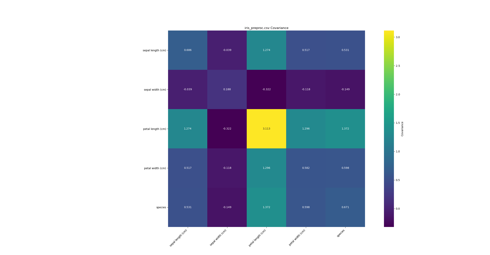

Normalized by Range Covariance:\
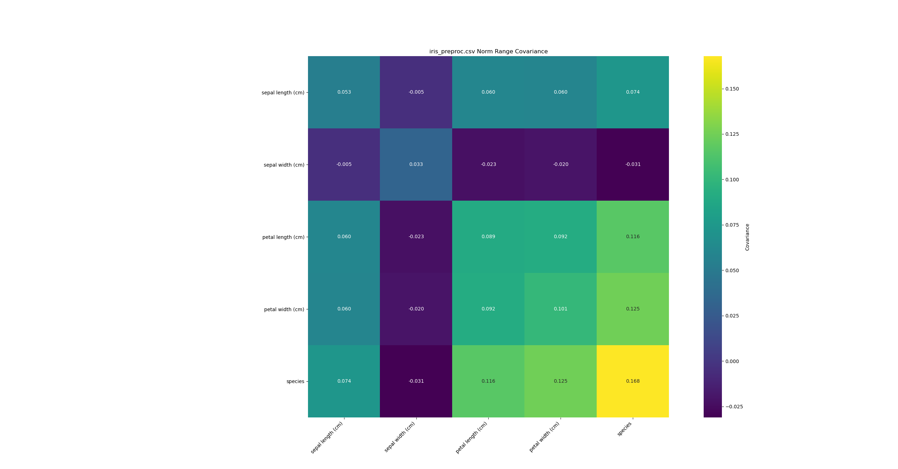

Normalized by Z-Score Covariance:\
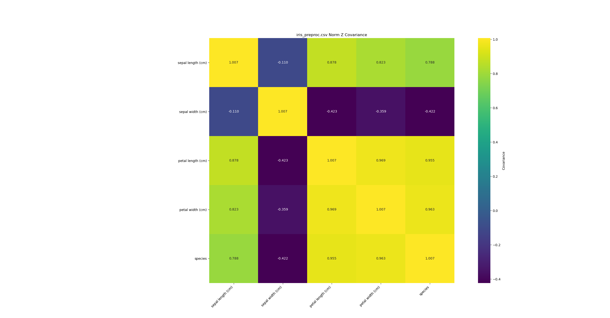

## Regression Models

Single Simple Model:\
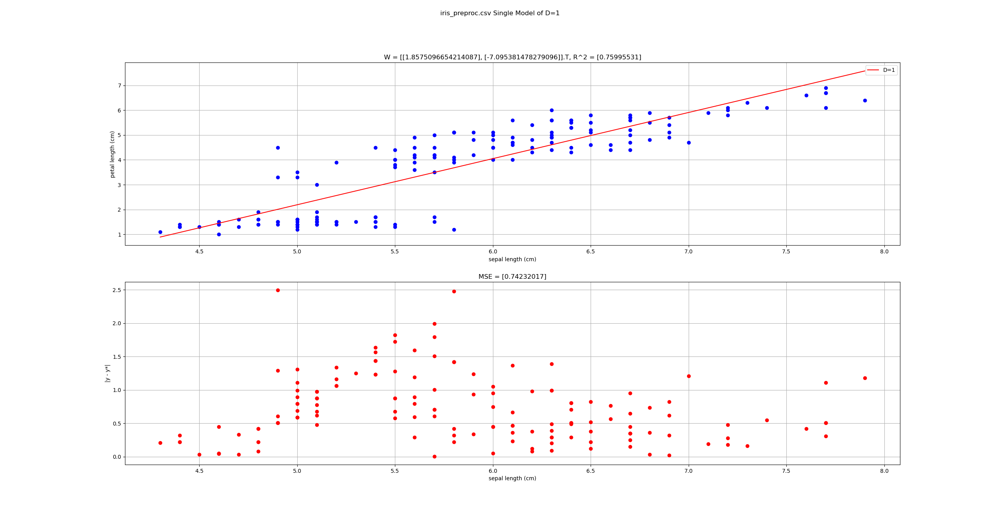

Polynomial Single Model:\
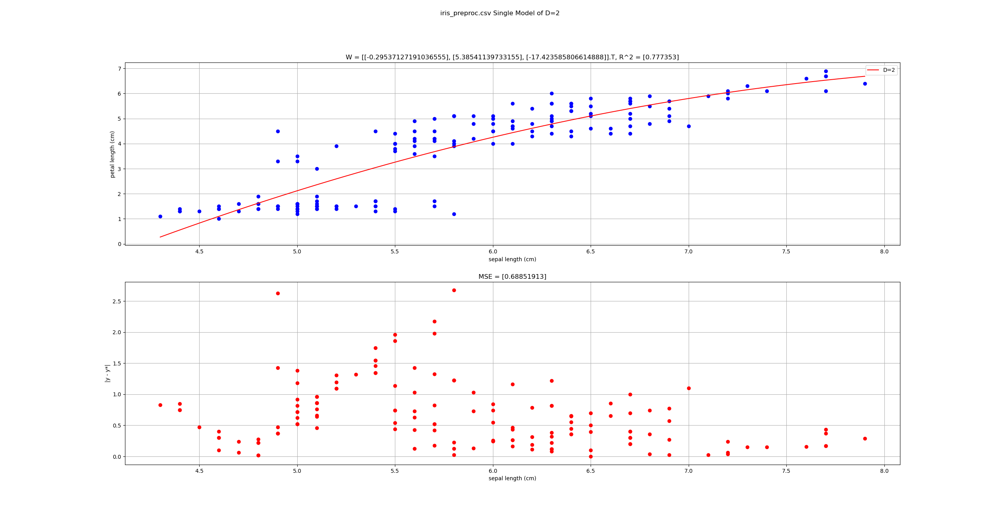

# Part II: Real-World Analysis

## 1. Describe your dataset

My dataset contains stats about pokemon. The following list of features is from the [kaggle page](https://www.kaggle.com/rounakbanik/pokemon) I got the dataset from. They are not in order as they appear in the dataset.

- name: The English name of the Pokemon
- japanese_name: The Original Japanese name of the Pokemon
- pokedex_number: The entry number of the Pokemon in the National Pokedex
- percentage_male: The percentage of the species that are male. Blank if the Pokemon is genderless.
- type1: The Primary Type of the Pokemon
- type2: The Secondary Type of the Pokemon
- classification: The Classification of the Pokemon as described by the Sun and Moon Pokedex
- height_m: Height of the Pokemon in metres
- weight_kg: The Weight of the Pokemon in kilograms
- capture_rate: Capture Rate of the Pokemon
- base_egg_steps: The number of steps required to hatch an egg of the Pokemon
- abilities: A stringified list of abilities that the Pokemon is capable of having
- experience_growth: The Experience Growth of the Pokemon
- base_happiness: Base Happiness of the Pokemon
- against_?: Eighteen features that denote the amount of damage taken against an attack of a particular type
- hp: The Base HP of the Pokemon
- attack: The Base Attack of the Pokemon
- defense: The Base Defense of the Pokemon
- sp_attack: The Base Special Attack of the Pokemon
- sp_defense: The Base Special Defense of the Pokemon
- speed: The Base Speed of the Pokemon
- generation: The numbered generation which the pokemon was first introduced
- is_legendary: Denotes if the pokemon is legendary.

My target feature is capture rate. 

## 2. Ask a question

My question is can you determine how hard a pokemon is to capture? I believe that regression analysis can help me answer this question because it is a question of whether there are associations between two variables. I want to be able to look at a certain feature of pokemon and be able to determine the capture_rate of that pokemon and this is what regression analysis is for. 

## 3. Preprocess

I did a bit of preprocessing before using this dataset. First I removed the japanese_name feature because I was having some unicode issues. Since I'm using pandas the unicode characters aren't an issue with this project but just in case I got rid of them. I also removed the against_? features because I was not interested in them and that's 18 less features to count the index of. Lastly I removed a single row because the capture_rate value had non numeric characters in it which broke things. In the future I can probably find a way to handle that in the program in case there are multiple rows like that.

## 4. Identify the input feature

I believe that base_total is the input feature that will help me most accurately predict capture_rate. I identified this feature based on the covariance between it and capture_rate and a scatterplot of the two features. base_total had the highest covariance of all the preprocessed features. The covariance indicated a decent negative assocation and the scatterplot visually confirmed what the covariance suggested. 

Pokemon Covariance:\
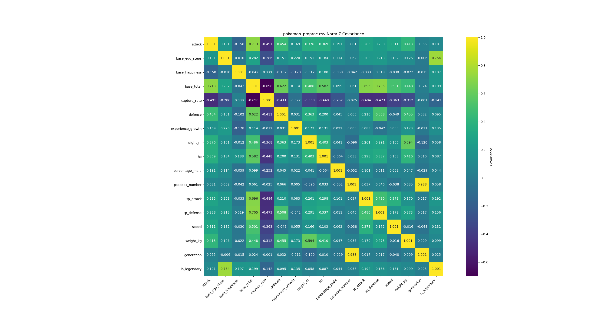

Pokemon Scatterplot:\
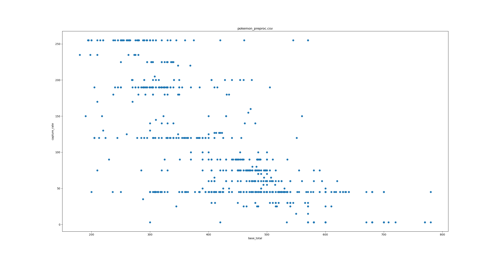

## 5. Simple single regression model

With the simple regression model there is an R^2 of 0.507 and an MSE of 2863.

The first element of the weight matrix describes the slope of the trend of the data. Ours is -0.455 which indicates a gentle negative slope. This means that as our input variable increases the output variable tends to decrease. The second element of the weight matrix describes how the output variable behaves when the input variable is 0. This is not useful in our case because there are no input data values near 0. 

Pokemon Simple Single Regression:\
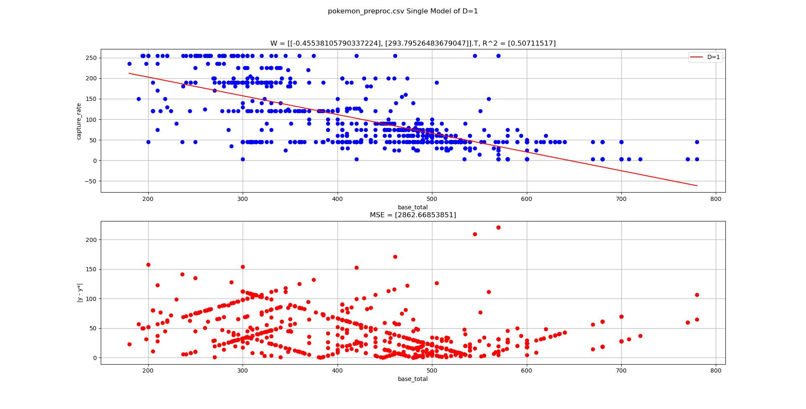

## 6. Polynomial single regression model

Pokemon Polynomial Single Regression (D=1 -> D=10):

D: 1, RSq: [0.50711517], MSE: [2862.66853851]\

D: 2, RSq: [0.53566928], MSE: [2696.8266752]\
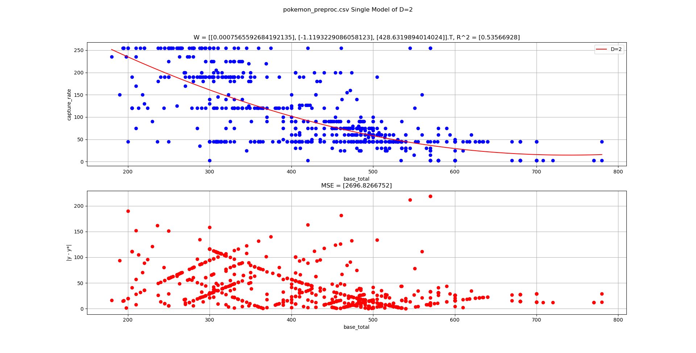

D: 3, RSq: [0.53712722], MSE: [2688.35899865]\

D: 4, RSq: [0.54374712], MSE: [2649.91068125]\
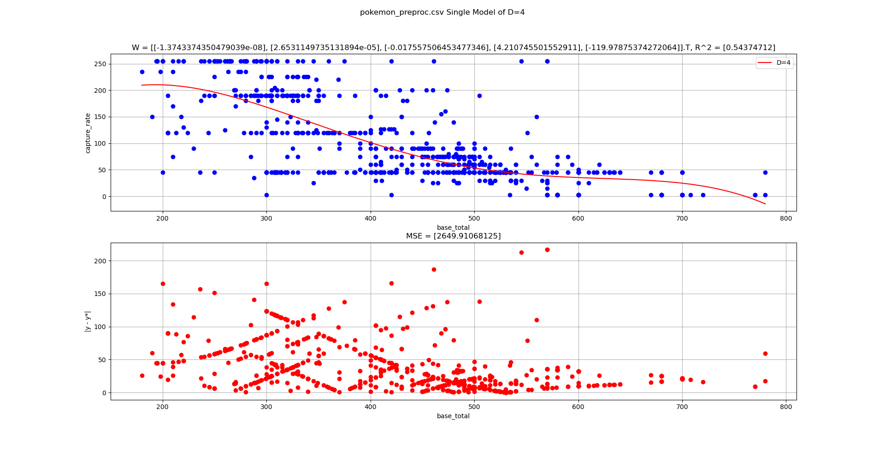

D: 5, RSq: [0.54980383], MSE: [2614.73338222]\
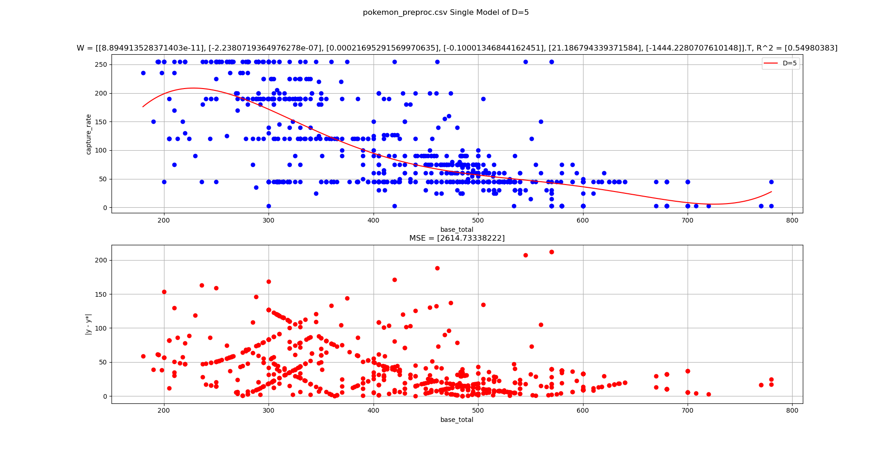

D: 6, RSq: [0.55091503], MSE: [2608.27955186]\
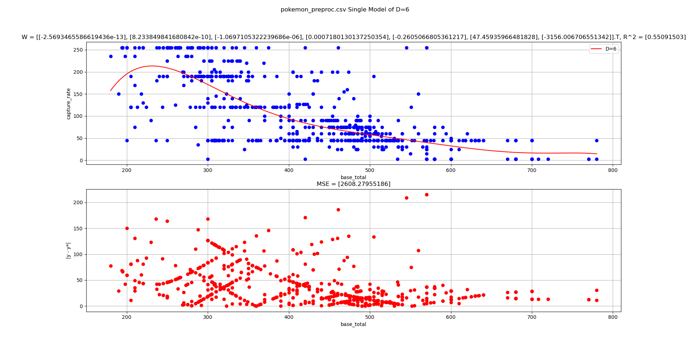

D: 7, RSq: [0.55173352], MSE: [2603.52580305]\
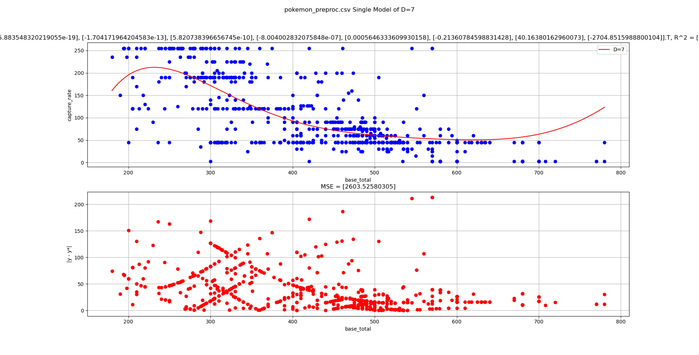

D: 8, RSq: [0.55238917], MSE: [2599.71779718]\
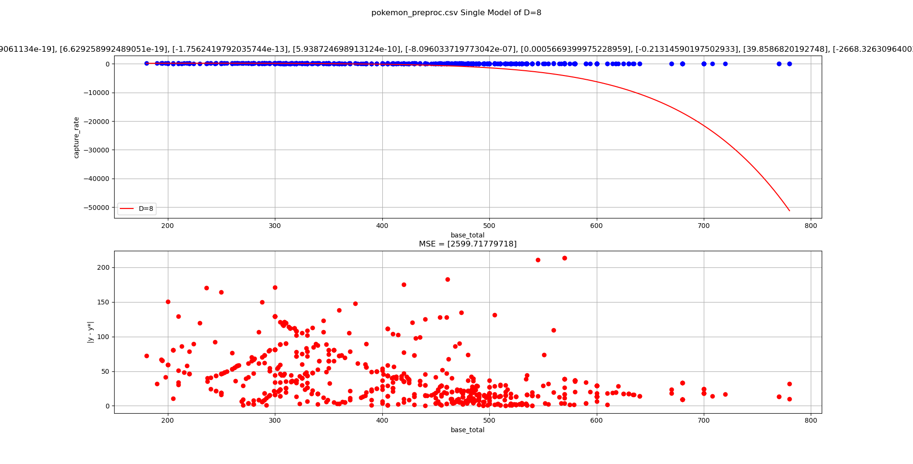

D: 9, RSq: [0.55299716], MSE: [2596.18657321]\

D: 10, RSq: [0.55387955], MSE: [2591.06169008]\
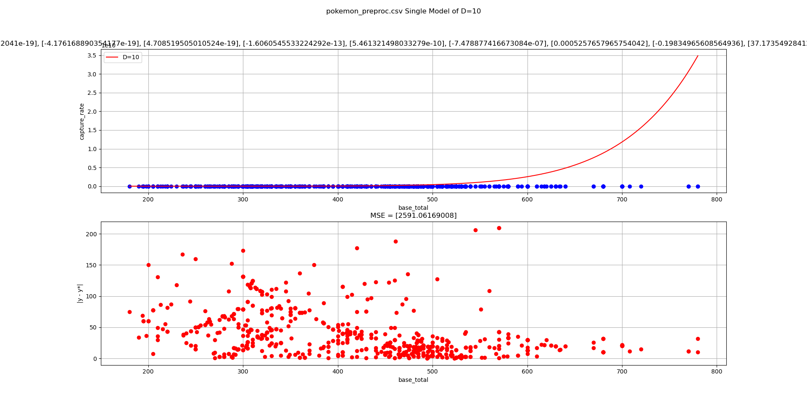

Anything after D=3 is overfititng. After D=3 the R^2 value really doesn't change very quickly. From D=4 to D=7 the regression line seems to have a lot of unnecessary curves in it. D=8 to D=10 the tail end of the regression line goes crazy. The MSE does decrease as D increases but after a certain point it doesn't really mean anything anymore.If you were to individually look at the residuals at the tail ends of the regression lines you would see huge values. After writing that last sentence I realized that my visualized residuals are nearly identical for all of the plots. There must be some error in my programming but I just can't find where it is. There should be much larger residuals on the right tail of the regression line.