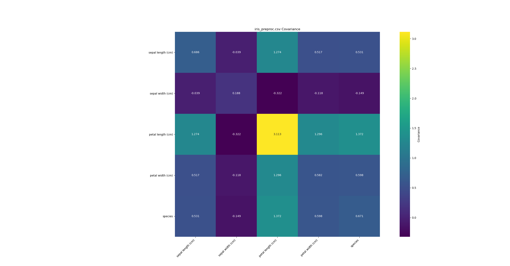
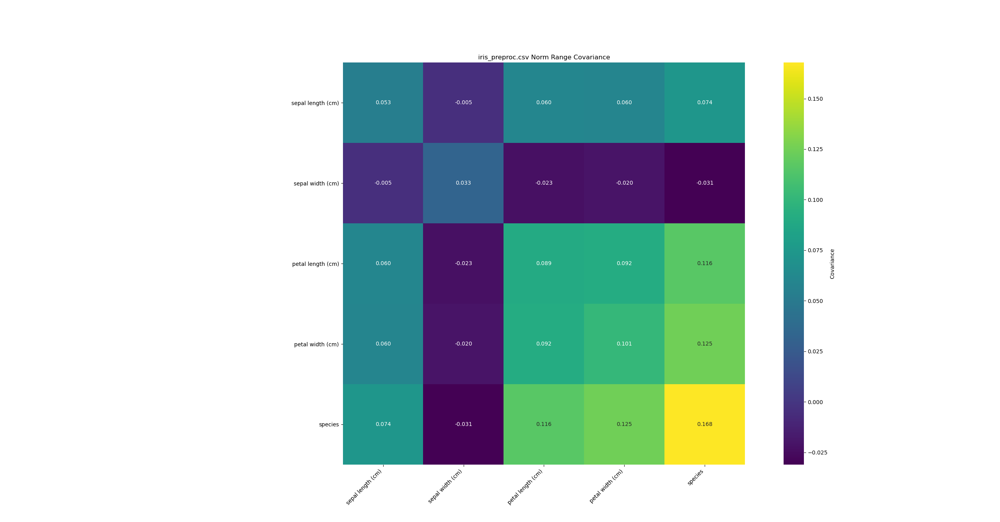
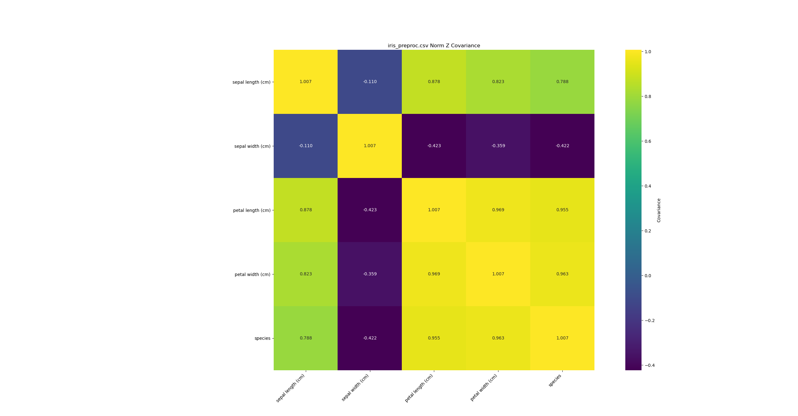
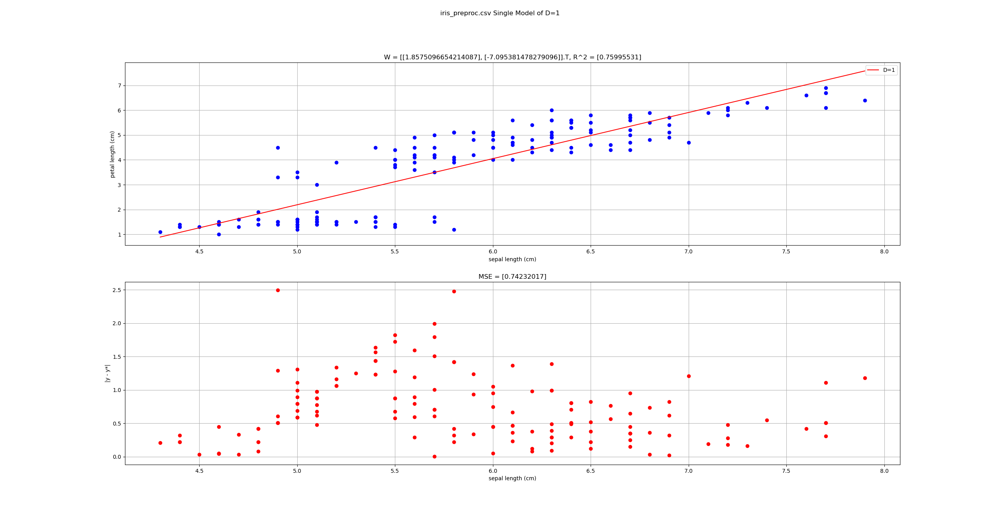
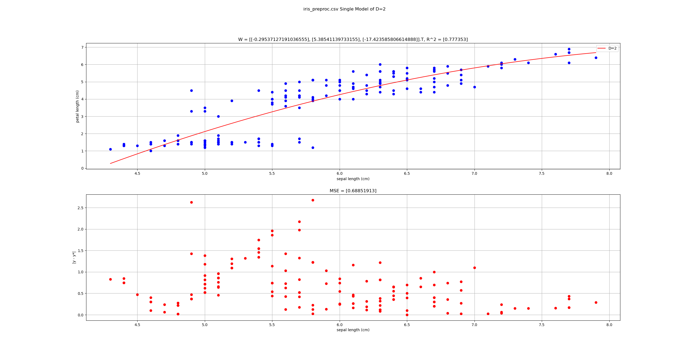
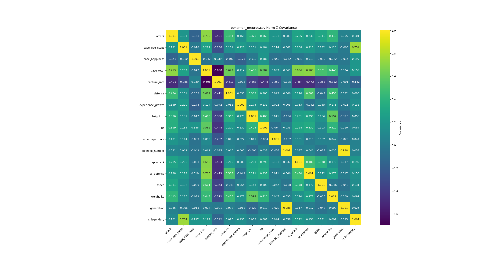
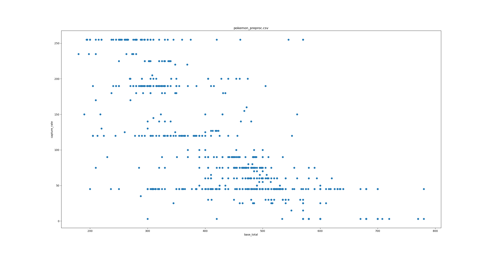

# Part 1: Iris Demo

## Covariance and Heatmaps

Raw Covariance:\

Normalized by Range Covariance:\

Normalized by Z-Score Covariance:\

## Regression Models

Single Simple Model:\

Polynomial Single Model:\

# Part II: Real-World Analysis

## 1. Describe your dataset

My dataset contains stats about pokemon. The following list of features is from the [kaggle page](https://www.kaggle.com/rounakbanik/pokemon) I got the dataset from. They are not in order as they appear in the dataset.

- name: The English name of the Pokemon
- japanese_name: The Original Japanese name of the Pokemon
- pokedex_number: The entry number of the Pokemon in the National Pokedex
- percentage_male: The percentage of the species that are male. Blank if the Pokemon is genderless.
- type1: The Primary Type of the Pokemon
- type2: The Secondary Type of the Pokemon
- classification: The Classification of the Pokemon as described by the Sun and Moon Pokedex
- height_m: Height of the Pokemon in metres
- weight_kg: The Weight of the Pokemon in kilograms
- capture_rate: Capture Rate of the Pokemon
- base_egg_steps: The number of steps required to hatch an egg of the Pokemon
- abilities: A stringified list of abilities that the Pokemon is capable of having
- experience_growth: The Experience Growth of the Pokemon
- base_happiness: Base Happiness of the Pokemon
- against_?: Eighteen features that denote the amount of damage taken against an attack of a particular type
- hp: The Base HP of the Pokemon
- attack: The Base Attack of the Pokemon
- defense: The Base Defense of the Pokemon
- sp_attack: The Base Special Attack of the Pokemon
- sp_defense: The Base Special Defense of the Pokemon
- speed: The Base Speed of the Pokemon
- generation: The numbered generation which the pokemon was first introduced
- is_legendary: Denotes if the pokemon is legendary.

My target feature is capture rate. 

## 2. Ask a question

My question is can you determine how hard a pokemon is to capture? I believe that regression analysis can help me answer this question because it is a question of whether there are associations between two variables. 

## 3. Preprocess

I did a bit of preprocessing before using this dataset. First I removed the japanese_name feature because I was having some unicode issues. Since I'm using pandas the unicode characters aren't an issue with this project but just in case I got rid of them. I also removed the against_? features because I was not interested in them and that's 18 less features to count the index of. Lastly I removed a single row because the capture_rate value had non numeric characters in it which broke things. In the future I can probably find a way to handle that in the program in case there are multiple rows like that.

## 4. Identify the input feature

I believe that base_total is the input feature that will help me most accurately predict capture_rate. I identified this feature based on the covariance between it and capture_rate and a scatterplot of the two features. base_total had the highest covariance of all the preprocessed features. The covariance indicated a decent negative assocation and the scatterplot visually confirmed what the covariance suggested. 

Pokemon Covariance:\

Pokemon Scatterplot:\

## 5. Simple single regression model

![pokemon_simple_reg]

## 6. Polynomial single regression model
