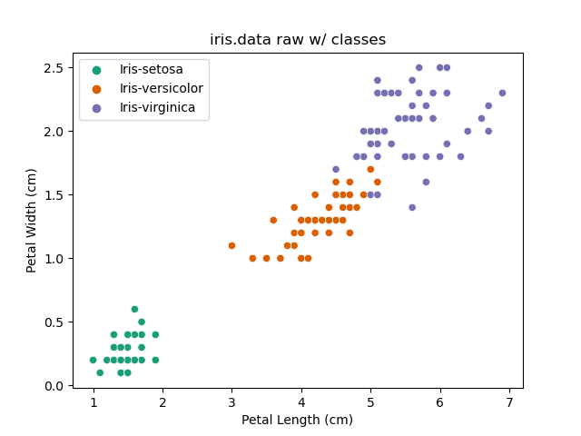
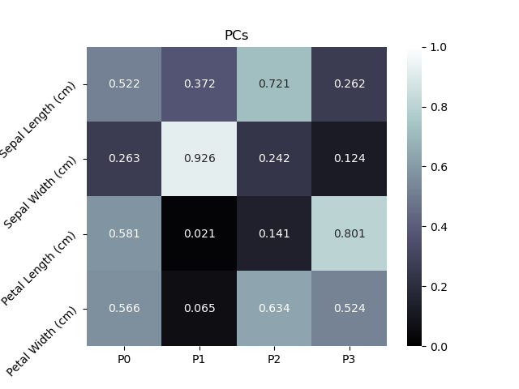
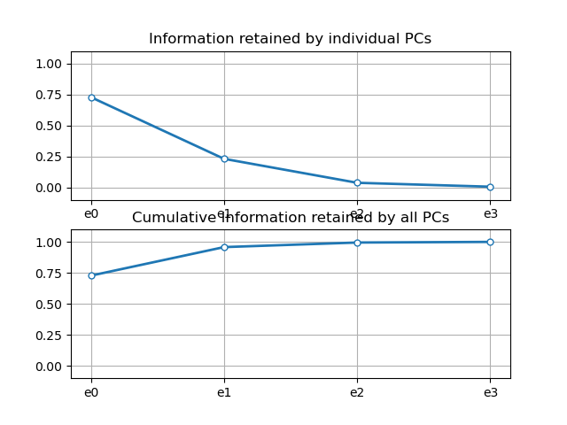
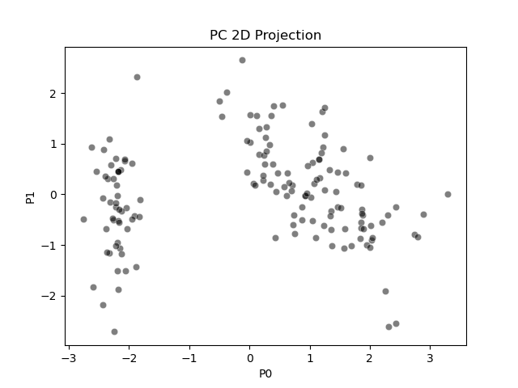
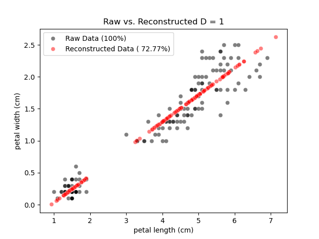
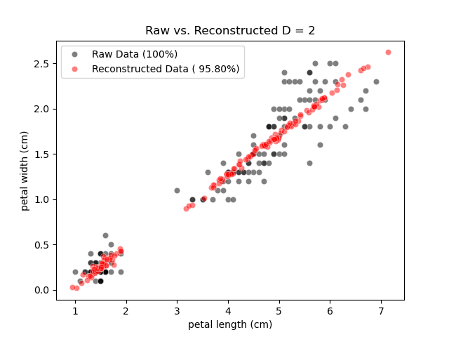
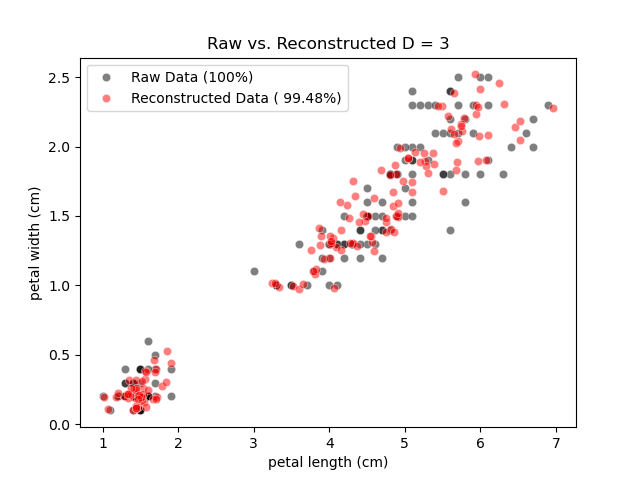
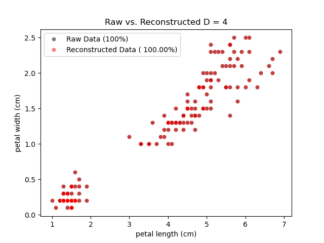
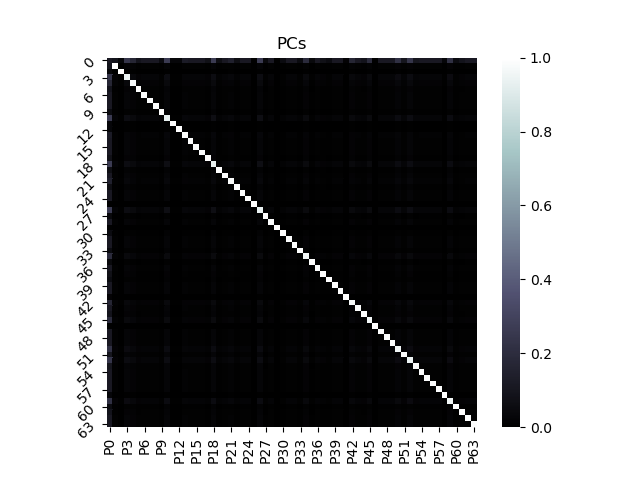

# Project 4 Report

## Part 1: Iris

Original dataset:\

The following figures were made by normalizing the iris data by z-score, calculating the principal components, sorting principal components by descending information retention, rotating the data onto the principle components, and reconstructing the data back into feature space. 

This figure was created by calculating the principal components and visualizing the matrix as a heatmap. This figure shows which direction the principal components are facing with respect to the features of the dataset. Since it shows which features are most varied it could be used to fuel a classification or clustering algorithm by looking at the most varied features and seeing if there are distinct clusters in them. 

This figure was created by calculating the eigenvalues of the principle components, sorting them in order of most information retained, and plotting them. This figure gives a visual aid and estimate for determining how many dimensions are needed to retain a specific percentage of information when reconstructing. 

This figure was created by taking the two highest information retaining principle components and plotting them against eachother. I kept the original principal component names through sorting although I'm not sure if it is better to just sort the data and leave the first column as the first principal component. In the case of iris the principal components were already in order. In principal component space it should be easier to see individual classes in groups.

The approximate degrees of information retention of ~25%, ~50%, ~75%, and ~100% don't really apply to the iris dataset. Instead I just projected all 4 dimensions since the number of features is small.

Initially looking at the reconstructions gave me a feeling that the information retention percentage doesn't match up with the visual. After looking at it for a bit it started making more sense to me since a lot of information was retained in the association/trend of the two features. As the dimensions increased the variation of the two features begins to return.

## Part 2 and 3: Optdigits and LFW Crop

I was unable to get PCA to work. I was able to get everything working with Iris but when I tried pulling samples from the datasets I could not get my PCA to work properly. I for some reason only have 1 or two eigenvalues being produced but the number of eigenvectors seems to be correct. I got a PC heatmap to appear but I have no way to sort the components without all of the eigenvalues. The heatmap that I was able to produce don't seem right so even though the number of PCs may have been correct they were not calculated properly for some reason. It looks like each principal component is pointing directly at each feature of the dataset. I used row 0 for my samples. 

I was entirely unable to get LFW Crop loaded. Pandas was not working nicely with the 3d matrix and I would have to rewrite a lot of the project for that to even load and sample. If we could set up a session to meet and figure out what's going wrong I would be very grateful.

Optdigits PC Heatmap:\
